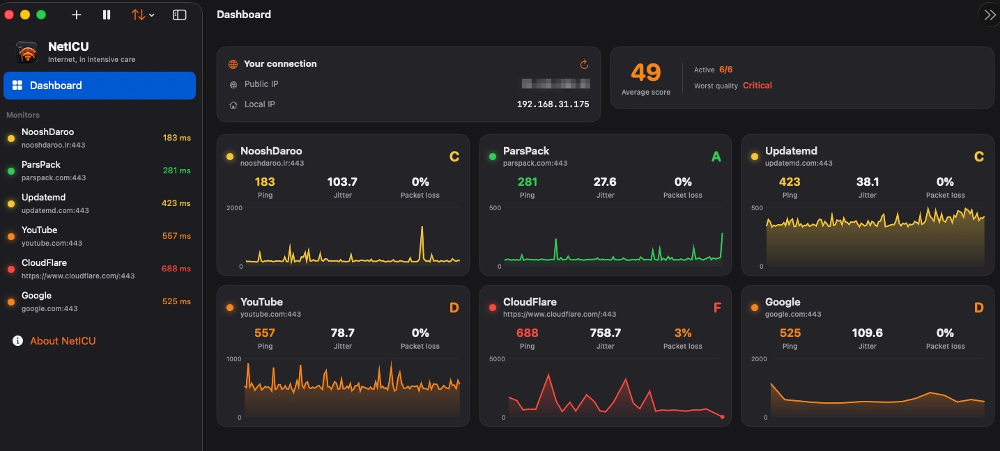

# NetICU

**Live internet-quality and server-performance monitor for macOS — built with unstable networks in mind.**

[🇮🇷 توضیحات فارسی پایین صفحه](#فارسی)



NetICU sits in your menu bar and continuously measures the health of your connection to the targets you care about — websites, servers, APIs — and tells you at a glance whether problems are on your side or theirs.

## Why NetICU?

On many networks — and especially in countries like Iran where internet disruption, throttling and outages are a daily reality — the hardest question is not *"is the internet slow?"* but *"**what exactly** is slow?"* Is it your Wi-Fi? Your ISP? The international gateway? Or just one specific server?

NetICU answers that by monitoring several targets **simultaneously** and breaking every measurement into its parts:

- **Two ping numbers, always in your menu bar.** Pick any two monitors — a typical setup in Iran is one **domestic** server (e.g. a local website or your VPS in a Tehran datacenter) and one **foreign** server (e.g. Google or Cloudflare). When the domestic number stays green but the foreign one turns red, you instantly know the problem is international connectivity, not your local network — and vice versa.
- **Server vs. network diagnosis.** The DNS / TCP / TLS / TTFB timing breakdown shows *where* latency lives: a high TTFB with low TCP means the server itself is slow; high TCP means network distance or congestion; high DNS means a resolver problem.
- **Quality calibration for slower networks.** Score thresholds are user-adjustable (defaults are tuned for higher-latency networks), so the gauge isn't permanently red just because your baseline ping is 150 ms.

## Features

- **Ping, jitter, packet loss** — measured over a rolling 2-minute window with 95th-percentile (p95) stats.
- **Timing breakdown** — DNS / TCP / TLS / TTFB phases for each probe.
- **Menu-bar gauge** — two live ping numbers, each tracking a monitor of your choice, colored by its own status.
- **Dashboard** — overview of all monitors with charts and A–F quality grades.
- **Server vs. network diagnosis** — distinguishes "my internet is bad" from "their server is slow."
- **Per-monitor proxy** — route individual monitors through a local SOCKS5/HTTP proxy (macOS 14+), so you can compare direct vs. proxied reachability of the same host.
- **Alert notifications** — get notified when a target's ping stays above a threshold (timeouts count too).
- **Public & local IP display** — see at a glance when your IP changes.
- **Recent logs, history clearing, quality-score calibration, drag-to-sort monitors.**

## Installation

Download `NetICU-1.4.1.zip` from the [Releases](https://github.com/aahonarmand/NetICU/releases) page, unzip it, and move `NetICU.app` to your Applications folder.

> **First launch — "NetICU can't be opened":** the app is not yet notarized by Apple, so macOS Gatekeeper blocks it on first launch. To allow it:
>
> 1. **Right-click** (or Control-click) `NetICU.app` and choose **Open**, then click **Open** in the dialog, **or**
> 2. Go to **System Settings → Privacy & Security**, scroll down to the message about NetICU, and click **Open Anyway**.
>
> This is only needed once. Alternatively, build from source (below) — apps you build yourself launch without this warning.

## Requirements

- macOS 13 or later (per-monitor proxy requires macOS 14+)
- Xcode 16+ to build from source

## Building

1. Clone the repository:
   ```bash
   git clone https://github.com/aahonarmand/NetICU.git
   ```
2. Open `NetICU.xcodeproj` in Xcode.
3. Select the **NetICU** scheme and press ⌘R.

The project uses filesystem-synchronized groups (Xcode 16+), so any `.swift` file placed in the `NetICU/` folder is picked up automatically.

## Architecture

| File | Role |
|---|---|
| `NetICUApp.swift` | App entry point, menu-bar gauge, settings window |
| `Models.swift` | Data models, rolling-window statistics, calibration |
| `PingEngine.swift` | Measurement engine (URLSession, proxy support) |
| `MonitorViewModel.swift` | Monitoring loop, history, IP, notifications, sorting |
| `ContentView.swift` | Main window, monitor details, logs |
| `DashboardView.swift` | Dashboard view |
| `Components.swift` | Cards, charts, gauges |
| `AboutView.swift` | About screen and metrics glossary |
| `Localization.swift` | UI strings |

## Roadmap

- Bufferbloat / latency-under-load (RPM)
- Bandwidth measurement (download/upload)
- Wi-Fi quality (RSSI) via CoreWLAN
- Configurable statistics window length
- Windows/Linux version

## Changelog

| Version | Highlights |
|---|---|
| 1.4.1 | Code-quality release: full stats-window coverage at short intervals, session-leak fix, IP refresh stops with monitoring, thread-safe metrics collection, dead-code removal |
| 1.4.0 | Fillable menu-bar gauge, quality calibration thresholds, outage chart-drop fix |
| 1.3.0 | English-only UI, per-monitor proxy, server/network diagnosis, alert notifications, recent logs, clear history |
| 1.2.0 | About section, in-app metric help, version display |
| 1.1.0 | Timing breakdown (DNS/TCP/TLS/TTFB) and p95 |
| 1.0.0 | First release: ping, jitter, loss, dashboard, IP, sorting |

## License

[MIT](LICENSE) © Aliasghar Honarmand

*Developed by Aliasghar Honarmand in collaboration with Claude.*

---

<a name="فارسی"></a>

<div dir="rtl">

# NetICU — مانیتور زنده‌ی کیفیت اینترنت و پرفورمنس سرور برای مک

NetICU در نوار منوی مک می‌نشیند و به‌طور پیوسته کیفیت اتصال شما به مقصدهای دلخواه — سایت‌ها، سرورها و APIها — را می‌سنجد و در یک نگاه نشان می‌دهد مشکل از سمت شماست یا از سمت آن‌ها.

## چرا NetICU؟ (مخصوصاً برای کاربران ایرانی)

در ایران اختلال، کندی و قطعی اینترنت بخشی از زندگی روزمره است. سؤال سخت معمولاً این نیست که «اینترنت کند است؟» بلکه این است که «**دقیقاً کجا** کند است؟» — وای‌فای خانه؟ ISP؟ پهنای باند بین‌الملل؟ یا فقط همان یک سرور خاص؟

NetICU با مانیتورکردن **همزمان** چند مقصد به این سؤال جواب می‌دهد:

- **دو عدد پینگ، همیشه در نوار منو.** دو مانیتور دلخواه را انتخاب می‌کنی — ترکیب پیشنهادی برای ایران: یک سرور **داخل کشور** (مثلاً یک سایت ایرانی یا سرور مجازی‌ات در دیتاسنتر داخلی) و یک سرور **خارج از کشور** (مثلاً گوگل یا کلادفلر). وقتی عدد داخلی سبز می‌ماند ولی عدد خارجی قرمز می‌شود، فوراً می‌فهمی اختلال از ارتباط بین‌الملل است نه از شبکه‌ی خودت — و برعکس.
- **تشخیص سرور یا شبکه.** تجزیه‌ی زمان به DNS / TCP / TLS / TTFB نشان می‌دهد تأخیر دقیقاً کجاست: TTFB بالا با TCP پایین یعنی خود سرور کند جواب می‌دهد؛ TCP بالا یعنی فاصله یا شلوغی شبکه؛ DNS بالا یعنی مشکل resolver.
- **کالیبراسیون برای شبکه‌های کندتر.** آستانه‌های امتیازدهی قابل‌تنظیم‌اند (پیش‌فرض‌ها برای شبکه‌هایی با پینگ بالاتر تنظیم شده‌اند) تا فقط به‌خاطر پینگ پایه‌ی ۱۵۰ میلی‌ثانیه‌ای، همه‌چیز همیشه قرمز نباشد.
- **پراکسی به‌ازای هر مانیتور.** هر مانیتور را می‌توانی جداگانه از یک پراکسی محلی SOCKS5/HTTP عبور دهی (مک‌اواس ۱۴ به بالا) و دسترسی مستقیم و دسترسی با پراکسی به یک مقصد را با هم مقایسه کنی.

## امکانات

- **پینگ، جیتر و افت بسته** — در پنجره‌ی متحرک ۲ دقیقه‌ای، همراه با صدک ۹۵ (p95).
- **تجزیه‌ی زمان** — مراحل DNS / TCP / TLS / TTFB برای هر اندازه‌گیری.
- **گِیج نوار منو** — دو عدد پینگ زنده، هر کدام برای یک مانیتور دلخواه، با رنگ وضعیت خودش.
- **داشبورد** — نمای کلی همه‌ی مانیتورها با نمودار و درجه‌ی کیفیت A تا F.
- **نوتیفیکیشن هشدار** — وقتی پینگ یک مقصد بیش از حد آستانه بالا بماند (تایم‌اوت هم حساب می‌شود) خبردار می‌شوی.
- **نمایش IP عمومی و محلی** — تغییر IP را فوری می‌بینی.
- **لاگ‌های اخیر، پاک‌کردن تاریخچه، تنظیم فرمول امتیاز، و مرتب‌سازی مانیتورها با کشیدن.**

## نصب

فایل `NetICU-1.4.1.zip` را از صفحه‌ی [Releases](https://github.com/aahonarmand/NetICU/releases) دانلود کن، از حالت فشرده خارج کن و `NetICU.app` را به پوشه‌ی Applications منتقل کن.

> **اجرای اول — پیام «NetICU can't be opened»:** چون اپ هنوز notarize نشده، Gatekeeper مک جلوی اجرای اول را می‌گیرد. راه حل:
>
> ۱. روی `NetICU.app` **راست‌کلیک** (یا Control+کلیک) کن و **Open** را بزن، بعد در پنجره‌ی بازشده دوباره **Open** را بزن، **یا**
>
> ۲. به **System Settings → Privacy & Security** برو، پایین صفحه پیام مربوط به NetICU را پیدا کن و **Open Anyway** را بزن.
>
> این کار فقط یک‌بار لازم است. راه دیگر: ساخت از سورس (راهنمای بالا در بخش انگلیسی) — اپی که خودت بسازی بدون این هشدار اجرا می‌شود.

## نیازمندی‌ها

- مک‌اواس ۱۳ به بالا (پراکسی به‌ازای هر مانیتور نیازمند مک‌اواس ۱۴+)
- برای ساخت از سورس: Xcode 16+

## مجوز

[MIT](LICENSE) © علی‌اصغر هنرمند

*توسعه‌یافته توسط علی‌اصغر هنرمند با همکاری Claude.*

</div>
